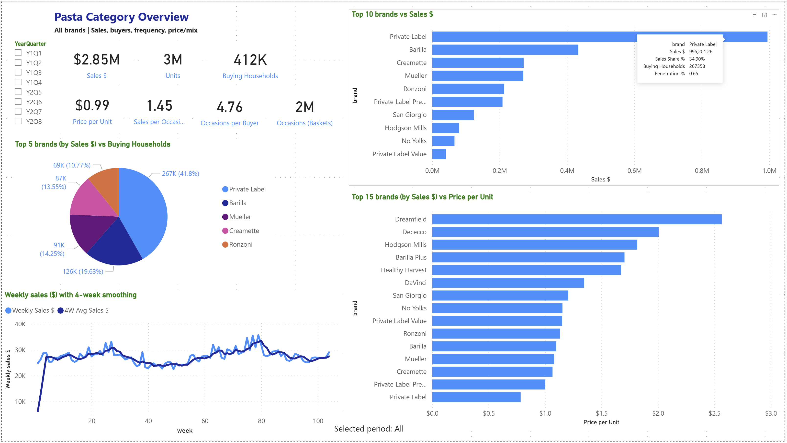
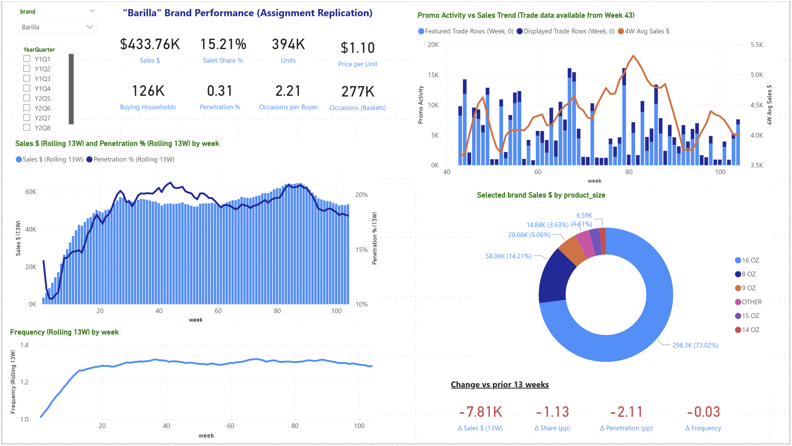
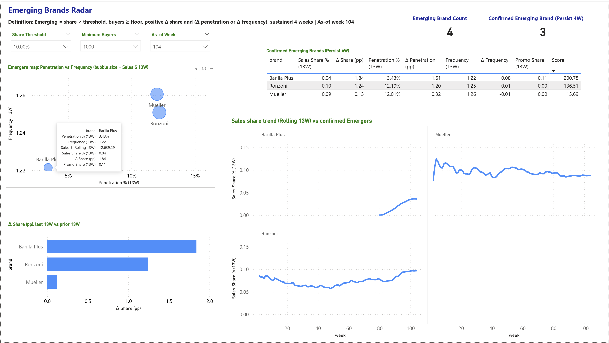

# Pasta Category Dashboard — Power BI
### Barilla Replica + Emerging / Challenger Brands Radar

> **Data projects don't end — they evolve.**

This repo contains a Power BI dashboard template rebuilt from a Python academic assignment and extended into an original Emerging / Challenger Brands Radar. The dataset is the Pasta subset of the Dunnhumby Carbo-Load data.

**✅ What's included:** Power BI template (no data), screenshots, and a PDF carousel  
**🚫 What's not included:** Raw dataset (licensing — see [Data](#data) section)

---

## Dashboard — 3 Pages

**01 Category Overview**  
Category health and structure: Sales, Units, Buying Households, Occasions, Frequency, Price/Mix, top brands, and weekly trend. Available for all periods and filtered to final quarter (Y2Q8).

**02 Barilla — Assignment Replication**  
Interactive Barilla view: sales share, penetration, frequency, promo overlay (feature/display vs sales trend), product size mix, and rolling 13W change vs prior period.

**03 Emerging / Challenger Brands Radar** *(original extension)*  
A reusable radar that surfaces brands gaining share via penetration or frequency momentum — with adjustable noise controls, buyer floor, share ceiling, and persistence filter.

---

## Screenshots

### 01 Category Overview


### 02 Barilla Replication
 

### 03 Emerging / Challenger Brands Radar


---

## Key Findings

- **Category demand is stable** — $2.85M across 8 quarters, ~22% seasonal variation, no structural growth or decline. Share shifts come from penetration + visibility, not category expansion.
- **Promos create short-term lift** — Barilla's Y1Q4 share spike (98% of transactions tied to feature promotions) faded once activity ended. Visible directly in the promo overlay.
- **Double Jeopardy holds** — All brands fall below the 45° line in the DJ check. Loyalty scales with size; no brand breaks the law.
- **Barilla Plus is the standout emerging signal** — 0.04% share, Emerging Score 200.78, gaining via penetration (+1.61pp) and frequency (+0.08) with minimal promo support. Smallest brand. Clearest momentum.

---

## Emerging / Challenger Radar — Framework Definition

A brand is flagged as emerging when it meets **all** of the following conditions:

```
Share       < ShareThreshold        (default: 5%)
Buyers      ≥ BuyerFloor            (default: 1,000)
Δ Share     > 0                     (last 13W vs prior 13W)
AND         (Δ Penetration > 0
             OR Δ Frequency > 0)
Sustained   ≥ 4 consecutive weeks   (persistence filter)
```

All parameters are adjustable via slicers. Private Label excluded by default (different competitive dynamics).

**"Challenger mode"** — set ShareThreshold = 10% to include mid-tier brands. This shifts interpretation from *small brands gaining ground* to *established challengers building momentum* — useful for competitive monitoring beyond just new entrants.

**Confirmed Emerging Brands (Week 104, default settings):**

| Brand | Sales Share % | Δ Share (pp) | Penetration % | Δ Penetration | Frequency | Score |
|---|---|---|---|---|---|---|
| Barilla Plus | 0.04 | +1.84 | 3.43% | +1.61 | 1.22 | **200.78** |
| Ronzoni | 0.10 | +1.24 | 12.19% | +1.20 | 1.25 | 136.51 |
| Mueller | 0.09 | +0.13 | 12.01% | +0.32 | 1.26 | 15.69 |

---

## Repository Structure

```
pasta-category-powerbi-emerging-radar/
│
├── README.md
├── Pasta_Brand_Analysis.pbit       ← Power BI template (model + measures + visuals, no data)
│
├── screenshots/
│   ├── 01_category_overview_AllPeriod.png
│   ├── 01_category_overview_Y2Q8_LastPeriod.png
│   ├── 02_barilla_replica.png
│   ├── 03_emerging_brands_radar.png
│   └── data_model.png
│
├── assets/
│   └── carousel.pdf                ← LinkedIn carousel deck
│
└── data/
    └── README.md                   ← Required files, column structure, setup notes
```

---

## How to Run

1. Install [Power BI Desktop](https://powerbi.microsoft.com/desktop/) (free)
2. Obtain the dataset — see `/data/README.md` for required files and folder structure
3. Open `Pasta_Brand_Analysis.pbit`
4. When prompted, set the folder path to your local `/data` directory
5. Refresh the model

> ⚠️ **Important:** The `upc` field must be formatted as **Text** (not Integer) across all tables to avoid join failures. Check this first if relationships are not resolving correctly.

---

## Tools & Methods

| Area | Detail |
|---|---|
| Languages | Python, SQL, DAX |
| Libraries | pandas, numpy, scipy, matplotlib, seaborn |
| BI Tool | Power BI Desktop |
| Models | NBD–Dirichlet, Zero-Truncated Poisson, Double Jeopardy |
| Framework | Byron Sharp — *How Brands Grow* (2010) |

---

## Data

**The raw dataset is not included in this repository due to licensing restrictions.**  
This repo shares a template and documentation so anyone with legitimate access to the dataset can reproduce the dashboard.

The dataset used is the **Dunnhumby — The Complete Journey (Carbo-Load)** dataset:  
[www.dunnhumby.com/source-files](https://www.dunnhumby.com/source-files)

See `/data/README.md` for required filenames, expected column structure, and setup notes.

---

## Academic Context

This project originated as Assignment 2 for **156761 Customer Insights** at **Massey University** (September 2025). The Power BI rebuild and Emerging Brands Radar extension were completed independently as a portfolio project.

---

## Author
**Kyaw Thurein**  
[LinkedIn](https://linkedin.com/in/kyaw-thurein-myint) · [GitHub](https://github.com/KyThureinM)
